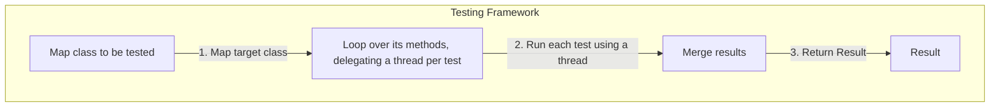

### TEST FRAMEWORK-ISH
This is a tiny testing framework I did to understand how reflection really works.

```
I used parallelization only for playing purposes.
```

## Workflow



**No vibe coding folks**
